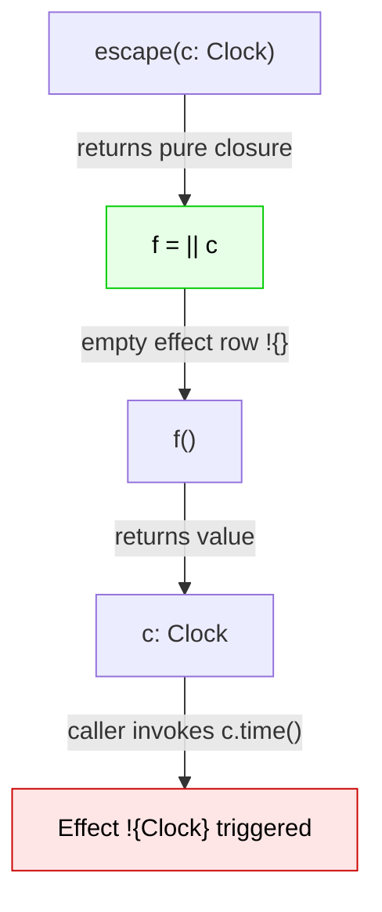

# NOVA — Capability Model Specification

**Status:** Production Design Reference  
**Cross-References:** [RFC 0001](../../RFC/0001-core-capability-effects.md), [EFFECT-SYSTEM.md](EFFECT-SYSTEM.md), [SECURITY-MODEL.md](SECURITY-MODEL.md), [SAFETY-GUARANTEES.md](../../research/SAFETY-GUARANTEES.md)

---

## 1. Foundations of Object Capabilities in NOVA

NOVA enforces the **Object-Capability (OCAP) Model** (Miller 2006, Dennis & Van Horn 1966) directly in the type system:

1. **No Ambient Authority:** There is no global state, no `import std.io`, and no free `print()` / `socket()` / `open()`. A module or function has zero ambient authority to touch the outside world.
2. **Unforgeability:** Capability values cannot be synthesized from integers, strings, or type casting (`E0112`).
3. **Explicit Delegation:** Authority can only be granted by passing a capability value as an argument or closing over it.
4. **Fine-Grained Attenuation:** Capabilities can be restricted (e.g., converting a read-write filesystem capability into a read-only capability for a single subdirectory).

```nova
// Root authority arrives at main entrypoint
fn main(rt: Runtime) -> Int ! {Runtime} {
    // Attenuate runtime capability into sub-capabilities
    let fs = rt.fs();       // Filesystem capability
    let net = rt.net();     // Network capability
    
    // Pass strictly required capability to helper
    process_logs(fs, "/var/log/app.log");
    0
}

// process_logs ONLY has Filesystem authority, CANNOT access Network or Clock
fn process_logs(fs: Filesystem, path: String) -> () ! {Filesystem} {
    let content = fs.read(path);
    // net.connect(...) is impossible: 'net' is not in scope
}
```

---

## 2. Capability Attenuation & Sub-typing

Capabilities support monotonic attenuation (restricting power):

```nova
// Filesystem attenuation hierarchy
trait ReadOnlyFS {
    fn read(self, path: String) -> Result<String, Error> ! {Filesystem};
}

impl ReadOnlyFS for Filesystem {
    fn read(self, path: String) -> Result<String, Error> ! {Filesystem} {
        self.read_file(path)
    }
}
```

---

## 3. Capability Bundling in Structs

Structs can store capability values. Constructing a struct that holds capabilities is **pure**; exercising the capability through field projection performs the effect and is strictly tracked by the verifier:

```nova
struct ServiceClient {
    net: Network,
    db: Database,
}

// Pure construction (no effect)
fn new_client(net: Network, db: Database) -> ServiceClient {
    ServiceClient { net: net, db: db }
}

// Exercising capability through fields registers effects in row ! {Network, Database}
fn sync_data(client: ServiceClient) -> Result<(), Error> ! {Network, Database} {
    let data = client.net.get("https://api.example.com/sync")?;
    client.db.execute("INSERT INTO records VALUES (?)", data)?;
    Ok(())
}
```

---

## 4. Closure Containment & Anti-Laundering

In conventional capability systems, authority captured in a closure escapes type signatures. In NOVA, the static **Capability Reachability Pass** guarantees:

$$\forall f = (\lambda x.\, e), \quad \text{ReachableCaps}(f) \subseteq \text{EffectRow}(f)$$

Any capability accessed inside $e$ is surfaced directly in the closure's effect row. Closures cannot act as authority laundromats.

### 4.1 Defeating Return Capability Laundering (Attack 21)

Attack vector 021 ([`021-attack-return-capability-value.nova`](../../tests/conformance/021-attack-return-capability-value.nova)) attempts to launder authority by capturing a capability in a closure that performs no effects, merely returning the capability value to the caller:

```nova
fn escape(c: Clock) -> (() -> Clock) {
    || c
}
```

The closure `|| c` does not *use* `c`, so its effect row is empty. One might expect this to successfully launder the capability out of the effect system. However, NOVA's defense relies on the **dual-layer** nature of its capability model:

1. **Value Visibility (Type System):** The return type `() -> Clock` explicitly exposes the capability in the type lattice. The caller *knows* it receives a capability.
2. **Usage Visibility (Effect System):** Any actual invocation of the capability is tracked by the effect row. The caller cannot *use* the capability without declaring it.

#### Transitive Reachability & Type Lattice Rules

The type lattice enforces that any capability value $C$ extracted from a closure retains type $C$. The effect-row checking rule for application then ensures that exercising $C$ requires $C$ in the ambient row $\Sigma$:

$$
\frac{
  \Gamma \vdash \text{escape} : (C) \rightarrow (() \rightarrow C) \quad
  \Gamma \vdash c : C
}{
  \Gamma \vdash \text{escape}(c) : () \rightarrow C
}
$$

$$
\frac{
  \Gamma \vdash f : () \rightarrow C \quad
  \Gamma \vdash f() : C \quad
  \Gamma, C \vdash C.\text{use}() \dashv \Sigma \cup \{C\}
}{
  \Gamma \vdash f().\text{use}() \dashv \Sigma \cup \{C\}
}
$$

#### Reachability Diagram



**Finding:** Capability *values* are made visible by ordinary typing. The effect row is only needed for capability *uses*. The two mechanisms cover disjoint cases, which is why [RFC 0001](../../RFC/0001-core-capability-effects.md) requires both layers. The laundering vector is neutralized because the caller must still declare `! {Clock}` to exercise the returned capability.

---

## 5. Package-Level Capability Manifests

In the NOVA package ecosystem, dependencies must statically declare the capabilities they require in their `manifest.toml`:

```toml
[package]
name = "analytics-lib"
version = "1.2.0"

[capabilities]
required = ["Network"]
forbidden = ["Filesystem", "Process", "Database"]
```

### Semantic Manifest Diffing
When upgrading a dependency, NOVA compares the capability footprint of the new version:
* **Safe Patch:** If the dependency uses the same or fewer capabilities, the update is accepted.
* **Authority Creep / Supply Chain Attack:** If a patch introduces a new capability (e.g., `analytics-lib` suddenly requests `Filesystem`), the build halts and requires explicit user authorization (`tools/manifest-diff.py`).
